# 🏭 Smart Bottle Line Vision QC

음료 페트병 생산 라인의 다공정 불량을 단일 GUI에서 통합 관리하는 **CNN 기반 비전 검사 시스템**

`PyTorch` · `Anomalib (PatchCore)` · `Ultralytics YOLO` · `Basler Pylon SDK`

---

## 📋 목차

1. [프로젝트 개요](#-프로젝트-개요)
2. [실행 화면](#-실행-화면)
3. [시스템 설계](#-시스템-설계)
4. [기술 스택](#-기술-스택)
5. [Station 1 — 입고공정 (PatchCore 이상탐지)](#-station-1--입고공정-patchcore-이상탐지)
6. [Station 2 — 조립후공정 (YOLO 객체탐지)](#-station-2--조립후공정-yolo-객체탐지)
7. [도메인 갭 분석](#-도메인-갭-분석--환경-변동-전후-실증)
8. [한계점 및 개선 방안](#-한계점-및-개선-방안)
9. [배운 점](#-배운-점)

---

## 🎯 프로젝트 개요

| 항목 | 내용 |
|------|------|
| 시스템 명 | Smart Bottle Line Vision QC |
| 개발 시점 | 2026.04 |
| 개발 형태 | 팀 프로젝트 |
| 주요 목표 | 음료 페트병 생산 라인의 다공정 불량을 통합 GUI로 관리 |
| 검사 공정 | Station 1 (입고 - 빈 페트병) + Station 2 (조립 후 - 완제품) |
| 하드웨어 | Basler 산업용 카메라 (Pylon SDK) |

### 한 줄 요약

> "공정 특성에 따라 적합한 모델을 분기 적용한 다공정 비전 검사 시스템.  
> 두 차례의 실험을 통해 촬영 환경(조명·고정도·결함 가시성)이  
> 검출 결과를 어떻게 좌우하는지 직접 실증함."

---

## 🖥 실행 화면

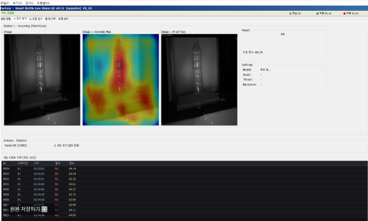

> Station 1 통합 GUI — 입고공정 페트병 NG 검출 사례. 좌측부터 입력 이미지 · Anomaly Map · Pred Mask · 결과 패널, 하단은 NG 이력 로그(Serial / 시각 / 점수 자동 기록). 「📦 Station 1」 섹션의 출력 형태를 그대로 반영.

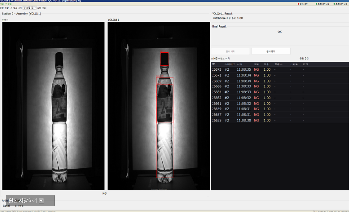

> Station 2 통합 GUI — 조립후공정의 라벨 정렬 NG 검출 사례. YOLO가 객체 자체는 검출하지만 **좌표 기반 정밀 판정**에서 카메라 각도 변동에 민감하게 반응한 케이스. 「🔍 도메인 갭 분석」 섹션의 Station 2 환경 의존성 패턴 참조.

---

## 🏗 시스템 설계

### 공정 특성 기반 모델 분기 설계

생산 라인의 두 공정은 **요구되는 검출 방식이 본질적으로 다름을** 분석하여, 공정마다 다른 모델을 적용했다.

| 구분 | Station 1 (입고공정) | Station 2 (조립후공정) |
|------|---------------------|----------------------|
| **검사 대상** | 빈 페트병 (라벨, 뚜껑 없음) | 완제품 페트병 |
| **결함 특성** | 결함 종류·위치 사전 정의 불가<br>(어떤 이물질·스크래치가 어디 생길지 미지) | 검사 항목이 enumerable<br>(캡 유무, 라벨 위치, 충진량) |
| **요구 검출 방식** | "정상에서 벗어난 모든 것"을 잡아야 함 | "정해진 부품 조합"이 맞는지 확인 |
| **선택 모델** | **PatchCore (이상탐지)** | **YOLOv11 (객체탐지)** |
| **선택 근거** | 정상 패턴만 학습 → 결함 라벨링 불필요<br>+ MVTec AD 벤치마크 SOTA급 산업용 결함 검출 | 사전 정의된 클래스 검출에 적합<br>+ 실시간 추론 가능 |
| **학습 데이터 수집 비용** | 정상 데이터만 필요 → 낮음 | 클래스별 라벨링 필요 → 높음 |
| **백본 / 버전** | Wide ResNet-50-2 (ImageNet 사전학습) | Ultralytics YOLOv11 |

> **💡 핵심 의사결정 논리**  
> 모델 자체의 성능이 아니라 "검사 항목이 enumerable한가"를 기준으로 분기.  
> 입고공정처럼 "무엇이 어디에 있을지 모를 결함"에는 정상 분포 학습이 적합하고,  
> 조립공정처럼 "정해진 부품 조합 확인"에는 객체 검출이 자연스럽게 맞는다.

### 통합 GUI 구조

- 단일 인터페이스에서 두 Station의 검출 결과 동시 모니터링
- Station 1: 입력 이미지 + Anomaly Map + Pred Mask + 결과 (NG/OK) + Score
- Station 2: 입력 이미지 + Detection Box + 클래스별 confidence + Final Result
- 설정: Model · Input · Threshold · Backbone (런타임 조정)
- NG 이력 로깅: Serial OK / NG ID / 시각 / 점수 자동 기록

---

## 🛠 기술 스택

| 구분 | 기술 |
|------|------|
| **언어** | Python |
| **프레임워크** | PyTorch |
| **이상탐지** | Anomalib · PatchCore |
| **객체탐지** | Ultralytics YOLOv8 / YOLOv11 |
| **백본** | Wide ResNet-50-2 (ImageNet 사전학습) |
| **산업용 카메라** | Basler Pylon SDK (`pypylon`) |
| **이미지 처리** | OpenCV |
| **GUI** | PySide / Tkinter 기반 통합 모니터링 |

---

## 📦 Station 1 — 입고공정 (PatchCore 이상탐지)

### 데이터 구성

```
data/station1/
├── normal/    # 정상 페트병 120장
├── abnormal/  # 불량 20장 (AUROC 검증용)
└── test/      # 테스트셋 50장 (정상 30 + 불량 20)
```

#### 입력 데이터 형태

| Station 1 (입고공정 — 빈 페트병) | Station 2 (조립후공정 — 완제품) |
|:---:|:---:|
| 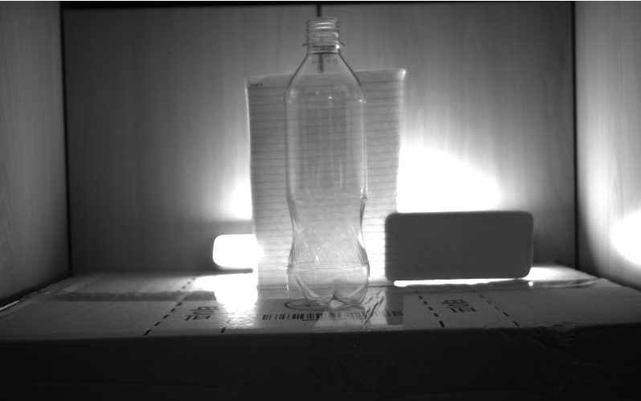 | 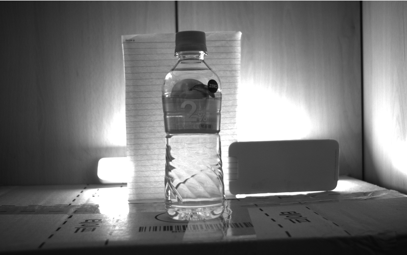 |

> 두 공정의 입력 데이터 형태 비교. 입고공정은 빈 페트병으로 결함 종류·위치를 사전 정의할 수 없는 반면, 조립후공정은 캡·라벨·충진량처럼 enumerable한 검사 항목이 정해진 완제품. 이 차이가 「🏗 시스템 설계」 섹션의 모델 분기 근거가 된다.

### 학습 성능

| 지표 | 값 |
|------|---:|
| 학습 F1 | **0.8421** |
| 추론 시간 (50장) | 7.0초 (≈ 140ms/장) |
| 정상 30장 과검(False Positive) | **0건 / 30** |
| 결함 검출률(Recall) | **17 / 20 = 85%** |

### 두 차례의 검증 실험

본 프로젝트에서는 카메라·조명 환경을 다르게 설정한 **두 차례의 50장 테스트를** 진행했다.  
두 실험은 결과적으로 **검출률(85%)은 동일하지만, 미검된 결함 종류가 다르게 나타나** 서로 다른 시사점을 남겼다.

---

### 🔬 1회차 실험 — 조명제어 미흡 환경

조명의 영향을 적게 받는 어두운 환경을 구성했지만, 페트병 지지대·주변 차광용 박스 위치가 촬영마다 미묘하게 변하는 환경.

#### 검출 대상 결함 종류 (1회차)

| 분류 | 결함 종류 | 의도 |
|------|---------|------|
| 강한 결함 | 파이리 인형 | 완전히 이질적인 객체 (sanity check) |
| 중간 결함 | 보드마카 표시 | 의도적으로 그린 표면 결함 |
| 경미한 결함 | 스크래치 | 표면의 미세 손상 |
| 작은 이물질 | 흰색 종이뭉치 | 투명 페트병 + 흰색 이물질 (배경과 유사) |

#### 50장 테스트셋 검출 결과 (1회차)

| 분류 | 개수 | 결과 |
|------|:---:|:---|
| 정상 | 30장 | **30장 모두 OK** ✅ |
| 강한 결함 (파이리) | 5장 | 5장 모두 NG ✅ |
| 중간 결함 (보드마카) | 5장 | 5장 모두 NG ✅ |
| 경미한 결함 (스크래치) | 5장 | 5장 모두 NG ✅ |
| **작은 이물질 (흰색 종이뭉치)** | **5장** | **2장 NG ✅, 3장 OK 오판 ❌** |

#### 미검 3건의 Anomaly Score 분포 (1회차)

| 카테고리 | 점수 범위 | 판정 |
|---------|----------|:---:|
| 정상 이미지 | 0.15 ~ 0.30 | OK ✅ |
| 강한 결함 (파이리) | 1.0000 | NG ✅ |
| 중간 결함 (보드마카) | 0.69 ~ 0.78 | NG ✅ |
| 경미한 결함 (스크래치) | 0.66 ~ 0.78 | NG ✅ |
| **흰색 종이뭉치 (실패한 3장)** | **0.3964 / 0.4047 / 0.4660** | **OK 오판 ❌** |

#### PatchCore 출력 형태 — 점수 그라데이션

| 정상 (Score 0.2580) | 보드마카 NG (Score 0.6983) | 파이리 NG (Score 1.0000) |
|:---:|:---:|:---:|
| 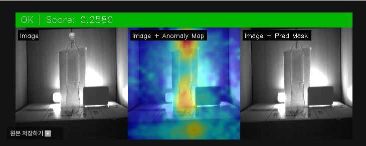 | 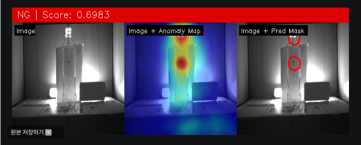 | 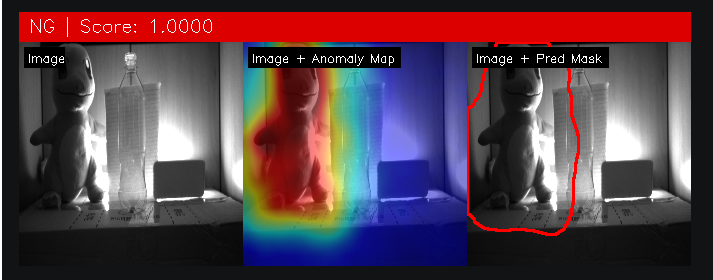 |

> 각 출력은 **Image · Image+Anomaly Map · Image+Pred Mask** 3분할로 구성. 점수 0.30 미만은 OK, 0.5 이상은 NG로 판정. 우측 파이리 인형은 모델이 정상 분포에서 가장 멀리 벗어난 입력에 대해 어떻게 반응하는지 확인하기 위한 sanity check 용 테스트 객체로, 점수가 정확히 1.0을 기록하며 모델 동작이 의도대로임을 검증.

#### 1회차 미검 사례 — 흰색 종이뭉치 (Score 0.4660)

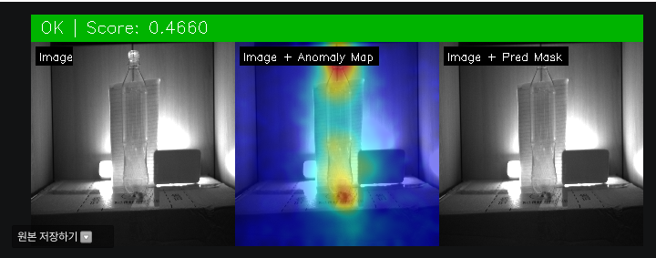

> 1회차에서 미검된 흰색 종이뭉치 3건 중 한 장. 페트병 하단 우측에 종이뭉치가 있지만 백라이트로 인해 배경과 동화되어 anomaly score가 임계값(0.5) 미만으로 산출됨. 「⚠️ 한계점」 섹션과 직접 연결되는 시각자료.

**1회차 인사이트:**  
투명 페트병 뒤편의 백라이트가 흰색 종이뭉치를 "배경의 일부"로 만들어 정상 분포에 가까운 점수가 산출됨. → 물리적 환경(조명·배경)이 **결함 검출 가능성 자체를** 결정한다는 점을 실증.

---

### 🔬 2회차 실험 — 조명제어 강화 환경

형광등·태양광 등 외부 광원의 영향이 더 줄어들도록 환경을 보강하고 페트병 지지대를 고정한 상태로 재실험.

#### 검출 대상 결함 종류 (2회차)

> 📌 **2회차 실험 설계 의도:** 1회차에서 대부분의 결함(파이리·보드마카·스크래치 15장)을 검출했던 것을 감안해, 검출 난이도를 높이기 위해 **결함 자체를 의도적으로 더 작게 제작하여** 모델의 분해능을 시험하는 데 초점을 맞췄다.

| 분류 | 결함 종류 | 의도 |
|------|---------|------|
| 중간 결함 | 보드마카 표시 | 의도적으로 그린 표면 결함 (1회차보다 작게) |
| 작은 이물질 (흰색) | 흰색 종이뭉치 | 1회차에서 미검됐던 결함 — 재검증 |
| 작은 이물질 (유색) | 유색 종이뭉치 | 색상 콘트라스트 확보된 이물질 |
| 경미한 결함 | 스크래치 | 표면의 미세 손상 (1회차보다 작게) |

#### 50장 테스트셋 검출 결과 (2회차)

| 분류 | 개수 | 결과 |
|------|:---:|:---|
| 정상 | 30장 | **30장 모두 OK** ✅ |
| 중간 결함 (보드마카) | 5장 | 5장 모두 NG ✅ |
| 작은 이물질 (흰색 종이뭉치) | 5장 | 5장 모두 NG ✅ (1회차 미검 → 검출 성공) |
| 작은 이물질 (유색 종이뭉치) | 5장 | 5장 모두 NG ✅ |
| **경미한 결함 (스크래치)** | **5장** | **2장 NG ✅, 3장 OK 오판 ❌** |

#### 미검 3건의 Anomaly Score 분포 (2회차)

| 카테고리 | 점수 범위 | 판정 |
|---------|----------|:---:|
| 정상 이미지 | ~0.30 | OK ✅ |
| 보드마카 | 0.69 ~ 0.78 | NG ✅ |
| 흰색 종이뭉치 | 0.97 ~ 0.99 | NG ✅ |
| **스크래치 (실패한 3장)** | **0.39 ~ 0.57** | **OK 오판 ❌** (임계값 0.5 근처) |

#### 환경 통제 효과 vs 결함 크기 한계

| 1회차 미검이었던 흰색 종이뭉치 → 2회차 검출 성공 (Score 0.9910) | 2회차에서 미검된 스크래치 (Score 0.4855) |
|:---:|:---:|
| 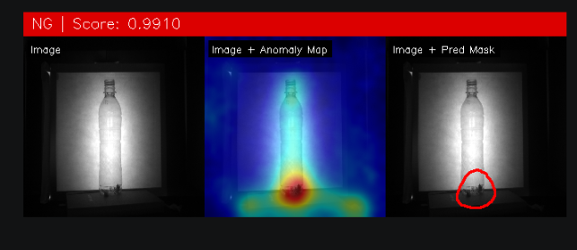 | 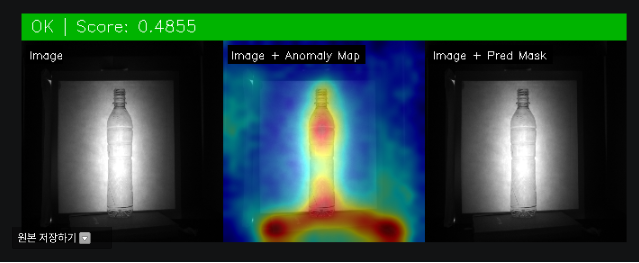 |

> **좌측:** 1회차에서 0.4660으로 미검됐던 흰색 종이뭉치가 환경 통제 강화 후 0.9910으로 명확히 검출 — 동일 결함이 환경에 따라 점수가 0.46 → 0.99로 폭증한 결정적 증거.  
> **우측:** 2회차 스크래치 미검 사례. 5장 중 2장은 검출(0.5099)됐기 때문에 모델 한계로 단정하기 어려움.

**2회차 인사이트:**  
조명을 통제하니 1회차에서 미검됐던 흰색 종이뭉치는 0.97 이상 점수로 명확히 검출됐다.  
스크래치는 5장 중 2장은 0.5099 등으로 검출됐지만, 3장이 임계값 근처(0.39~0.49)에 머물러 미검됐다.

**미검 원인 분석 — "모델 한계"로 단정하기 어려운 이유:**

- **5장 중 2장은 검출됨** → 모델이 스크래치 결함 종류 자체를 원천적으로 못 잡는 건 아님
- **2회차 실험 조건상 결함을 더 작게 제작** → 검출 난이도가 처음부터 높았음
- **실험실 셋업의 환경 변동 잔존** → 카메라 거리·각도, 페트병 미세 회전 등이 촬영마다 완전히 동일하지 않음. 실제 공장처럼 카메라 고정 지그·페트병 컨베이어 정렬이 갖춰진 환경이었다면 같은 결함도 검출 결과가 달랐을 가능성

**잠정 결론:** 2회차 미검의 주된 원인 역시 촬영 환경의 미세 변동 + 결함 크기를 작게 한 실험 조건의 결합으로 보는 것이 데이터에 부합한다. 모델 표현력의 절대적 한계라고 결론짓기에는 어떤 스크래치는 잡고 어떤 스크래치는 못 잡았는지의 패턴 분석을 위한 데이터가 부족하다.

**임계값 조정 가능성:** 임계값을 0.5에서 0.33 정도로 낮추면 미검은 줄겠지만, 다른 결함 유형의 과검 trade-off는 추가 검증 필요.

---

### 두 실험을 통합한 핵심 발견

| 회차 | 환경 통제 | 결함 크기 | 미검 결함 | 미검의 주된 원인 (분석) |
|:---:|:---|:---|:---|:---|
| 1회차 | 조명·지지대 흔들림 큼 | 통상 크기 | **흰색 종이뭉치** | **환경 변수가 결함 가시성을 약화시킴**<br>(백라이트 + 흰 이물질 → 배경 동화) |
| 2회차 | 조명 표준화 | **의도적으로 작게 제작** | **스크래치** (5장 중 3장) | **환경 미세 변동 + 결함 크기 축소의 결합**<br>(같은 결함 종류 중 2장은 검출됨) |

> 두 회차 모두 검출률은 85% (17/20)로 동일하지만,  
> 미검 결함이 달라진 본질은 "촬영 환경이 결함 가시성에 영향을 미치는 방식이 다르다"는 점이다.  
>
> - **1회차 환경 영향:** 환경 변수(빛 반사·배경) 자체가 결함을 보이지 않게 만듦
> - **2회차 환경 영향:** 작은 결함일수록 환경 미세 변동에 더 민감해짐
>
> 어느 회차도 "이 모델은 이 결함을 잡지 못한다"고 단정할 수 있는 데이터는 없다. → **공장 수준의 환경 통제(고정 지그·컨베이어 정렬)가 갖춰지면 미검률이 더 낮아질 가능성이 높음.**

---

## 📦 Station 2 — 조립후공정 (YOLO 객체탐지)

### 학습 클래스 (3개)

| 클래스 | 의미 |
|--------|------|
| `cap` | 뚜껑 |
| `label` | 라벨 |
| `fill_level` | 내용물 충진 라인 |

> OK/NG 판정 로직의 입력은 **`cap` / `label` / `fill_level` 3개 클래스의 존재 여부 + 위치(IoU 기반)**.

### 실제 환경 검증 결과 (정성 평가)

> ⚠️ **Station 2는 별도의 정량 테스트셋 평가는 진행하지 않고, 실제 환경 영상에서 정성적으로 검증함.**  
> mAP / Precision / Recall은 미측정 (한계점 항목 P3 참조).

**✅ 동적 판별 성공 항목:**
- 캡 유무 (confidence ≥ 0.9)
- 라벨 유무
- 충진량 (fill_level) 위치 검출

→ 카메라 조건이 다소 변해도 **객체 유무 판별은 강건하게 동작**

**❌ 판별 실패 항목:**
- **위치 불량** (라벨 정렬 어긋남 등)

**실패 원인 분석:**  
카메라 재설치 시 카메라-피사체 거리·각도가 미세하게 변동, 조명 환경(주변 차광용 박스·지지대 위치 등)도 촬영마다 미묘하게 변함  
→ **좌표 기반 정밀 판정의 기준 자체가 흔들림**

### 핵심 인사이트

> 같은 YOLO 모델이라도  
> "객체가 있느냐 없느냐"의 confidence 기반 판정과  
> "객체가 정확한 위치에 있느냐"의 좌표 기반 정밀 판정은  
> 환경 변동에 대한 강건성이 다르다.

---

## 🔍 도메인 갭 분석 — 환경 변동 전/후 실증

이 프로젝트의 가장 중요한 발견은 **두 모델이 환경 변동에 서로 다른 방식으로 반응한다는** 점이다.

### 환경 변동 전/후 정상 이미지 점수 비교

| 시점 | 정상 페트병 Anomaly Score | 임계값 대비 위치 | 판정 신뢰도 |
|------|:---:|:---|:---|
| 학습/초기 검증 | 0.15 ~ 0.30 | 임계값(0.5)과 충분히 이격 | 높음 ✅ |
| **카메라 재설치 후** | **0.39 ~ 0.40** | **임계값 근처로 이동** | **급락 ❌** |

> 정상 이미지의 점수가 임계값(약 0.40)에 근접 → 정상조차 "이상"으로 판정될 위험.  
> 모델 자체는 동일한데 입력 분포만 바뀌어도 판별 능력이 무너진다는 사실을 직접 관찰.

### 두 Station의 환경 의존성 비교

| 모델 | 환경 변동 영향 | 본질적 원인 |
|------|---------------|------------|
| **Station 1 — PatchCore** (이상탐지) | 정상 이미지 점수가 임계값 근처(~0.40)로 상승, 정상/결함 분류 신뢰도 급락 | **정상 분포 자체에 민감** — 학습 시 정상 패턴이 추론 환경과 달라지면 정상조차 "이상"으로 판정 |
| **Station 2 — YOLO** (객체탐지) | 객체 유무(cap/label/fill_level) 판별은 강건, 라벨 위치 등 좌표 기반 정밀 판정은 실패 | **좌표 정밀도에 민감** — 카메라 각도 변동 시 절대 좌표 기준이 흔들려 위치 비교 불가 |

### 시사점

- 산업 환경에서 비전 시스템을 운영하려면 **모델 선택만큼이나 환경 통제(카메라 고정 지그·조명 통제 등)가 중요**
- ML 모델은 "학습 분포 안에서만 정확하다"는 본질을 실제로 망가뜨려보며 체감
- 다음 단계 개선 방향:
  - **데이터 증강(augmentation):** 카메라 위치·조명을 의도적으로 다양화하여 학습 분포 확장
  - **입력 정규화:** ROI 검출 → 정렬(alignment) 전처리 추가
  - **환경별 적응 임계값:** 정상 데이터 기준으로 임계값 동적 조정

#### 실제 실험 환경

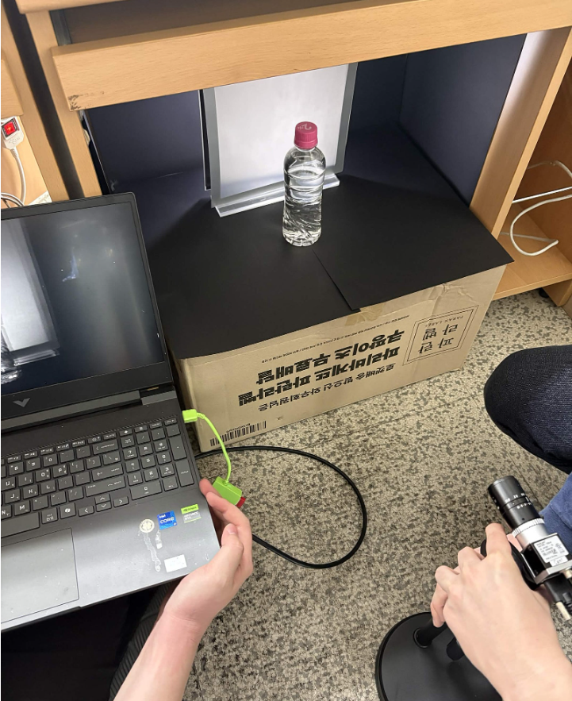

> 2회차 실험 셋업. Basler 산업용 카메라, 페트병 거치대, 운영용 노트북 구성. 종이박스를 활용한 외부 광원 차단으로 1회차 대비 조명 영향은 줄였지만, 공장 수준의 카메라 고정 지그나 컨베이어 정렬은 갖추지 못한 실험실 환경. 도메인 갭 분석에서 언급한 "환경 미세 변동"이 발생한 물리적 배경.

---

## ⚠️ 한계점 및 개선 방안

### 현재 한계점

1. **Station 1 - 경미한 결함 검출 한계:** 2회차에서 스크래치류 3건 미검 (전체 미검률 15%). 단, 5장 중 2장은 검출됐기 때문에 모델 자체의 한계인지, 환경 미세 변동의 결과인지 추가 검증 필요 — 공장 수준 환경 통제 하 재실험이 권장됨.
2. **Station 2 - 정량 평가 부재:** 별도 테스트셋 기반 mAP, Precision/Recall 미측정
3. **환경 강건성 부족:** 카메라 재설치·조명 변동에 정상 점수가 임계값 근처(~0.40)로 이동
4. **데이터셋 규모:** 정상 120장 / 불량 20장 수준으로 임계값 일반화에 한계

### 향후 개선 방안

| 우선순위 | 항목 | 설명 |
|:---:|------|------|
| **P1** | 카메라 고정 지그 설계 | 환경 변동을 물리적으로 차단 |
| **P2** | 데이터 증강 적용 | 위치·각도·조명 변동을 학습 데이터에 반영 |
| **P3** | Station 2 정량 평가 | 별도 테스트셋 구축 후 mAP, Precision/Recall 측정 |
| **P4** | 입력 정규화 파이프라인 | ROI 검출 + alignment로 좌표 기준 안정화 |
| **P5** | 적응형 임계값 | 정상 데이터 분포 모니터링 → 임계값 자동 조정 |

---

## 💡 배운 점

### 1. 모델 선택은 문제 특성에서 출발해야 한다

"이상탐지냐 객체탐지냐"를 결정하는 기준이 모델 자체의 성능이 아니라 "검사 항목이 enumerable한가"라는 것을 체감. 입고공정처럼 "무엇이 어디에 있을지 모를 결함"에는 PatchCore가, 조립공정처럼 "정해진 부품 조합 확인"에는 YOLO가 자연스럽게 맞아떨어진다는 걸 직접 두 모델을 운영하며 알게 됨.

### 2. ML은 학습 분포에 갇혀 있다

학습 환경에서 잘 작동하던 모델이라도 추론 환경이 미세하게 달라지면 결과가 무너진다는 사실을 두 Station에서 서로 다른 방식으로 경험. PatchCore는 정상 분포 자체가 흔들리고, YOLO는 좌표 기준이 흔들린다. **두 모델의 환경 의존성이 다른 형태로 나타난다는 걸 직접 디버깅하며 체감했고, 이 경험이 산업용 비전 시스템에서 "환경 통제는 모델 선택만큼 중요하다"는 결론으로 이어졌다.**

### 3. 가용 데이터로 어디까지 결론지을 수 있는지 명확히 하기

ML 실험에서 흔한 함정 중 하나는 "깔끔한 가설"에 데이터를 끼워 맞추는 것이다. 두 회차의 미검 결함이 다르길래 처음에는 "1회차는 환경 문제, 2회차는 모델 한계"라는 깔끔한 결론이 떠올랐다.  

그런데 2회차 데이터를 다시 보니 **스크래치 5장 중 2장은 검출되고 있었다.** 모델이 결함 종류 자체를 못 잡는 게 아니라, 어떤 스크래치는 잡고 어떤 스크래치는 못 잡았다는 뜻이다. 게다가 2회차는 결함을 의도적으로 더 작게 제작한 실험 조건이었고, 실험실 셋업이라 카메라가 100% 고정된 환경도 아니었다.  

→ 결국 "모델 한계"라고 단정짓기엔 데이터가 부족했고, **두 회차 모두 환경 변수가 주된 원인이지만** 환경이 결함 가시성에 영향을 미치는 방식이 다른 것이라는 결론이 데이터에 더 부합했다. 그럴듯한 가설을 만드는 것만큼이나 데이터로 그 가설을 기각할 수 있는지 보는 게 중요하다는 걸 직접 체감.

### 4. 산업용 비전은 환경 통제 + 모델의 합작

실험실에서 잘 되던 모델이 "카메라를 한 번 옮겼더니" 무너지는 걸 경험하면서, 산업 현장에서 비전 시스템을 운영한다는 게 결국 **카메라 고정 지그·조명 표준화·교체 절차** 같은 운영 환경의 표준화와 떼어놓을 수 없다는 걸 알게 됨.

---

이 프로젝트는 단순히 모델을 학습시키는 단계를 넘어, 실제 환경에서 ML이 어떻게 깨지는지를 직접 디버깅한 경험이었다.